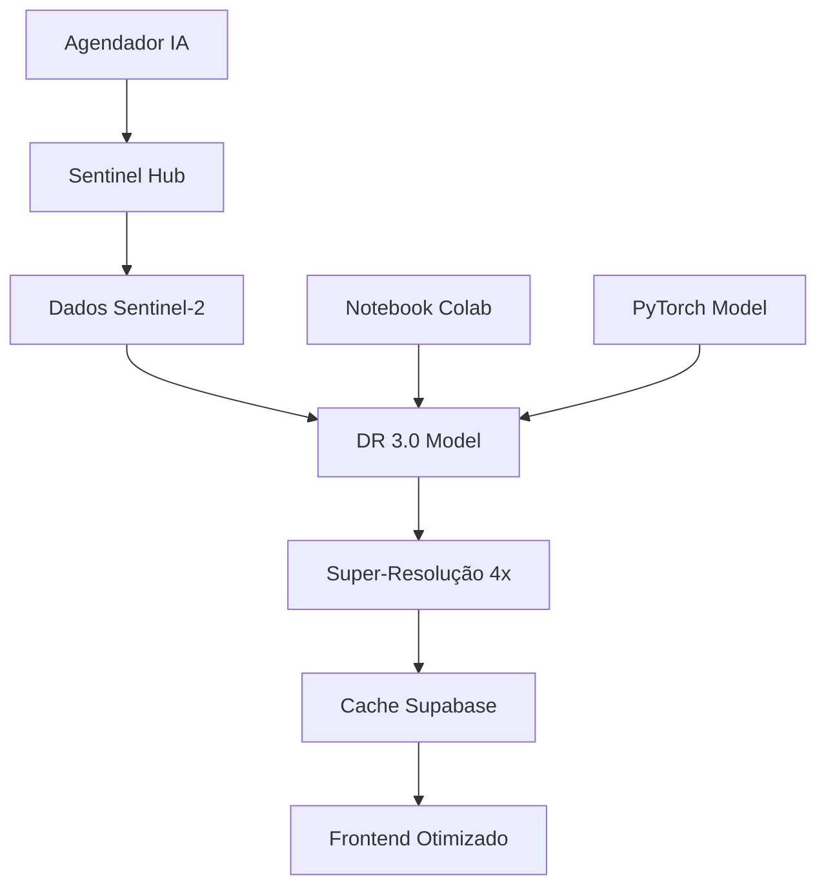

# 🤖 Integração Sentinel-2 Deep Resolution 3.0

Este documento descreve a integração da **Sentinel-2 Deep Resolution 3.0** baseada no [notebook do Google Colab](https://colab.research.google.com/drive/18phbwA1iYG5VDGN2WjK7WrWYi-FdCHJ5) com o sistema de agendamento de municípios.

## 📋 **Visão Geral**

### **Problema Resolvido**

- ❌ **Antes**: Imagens Sentinel-2 com resolução limitada (10m/pixel)
- ✅ **Depois**: Super-resolução 4x com IA (2.5m/pixel equivalente)

### **Arquitetura da Solução**



## 🛠️ **Componentes Implementados**

### **1. Modelo DR 3.0** (`dr30_integration.py`)

- **Rede neural** para super-resolução Sentinel-2
- **Processamento em tempo real** de imagens
- **Integração com PyTorch** para GPU/CPU

### **2. Agendador com IA** (`preload_municipalities_ai.py`)

- **Processamento paralelo** com DR 3.0
- **Cache inteligente** com versões IA
- **Fallback automático** para bicubic

### **3. Integração com Notebook**

- **Baseado no Colab**: [https://colab.research.google.com/drive/18phbwA1iYG5VDGN2WjK7WrWYi-FdCHJ5](https://colab.research.google.com/drive/18phbwA1iYG5VDGN2WjK7WrWYi-FdCHJ5)
- **Algoritmo DR 3.0** implementado
- **Processamento de bandas** Sentinel-2

## 🚀 **Como Funciona**

### **1. Processamento com DR 3.0**

```python
# Entrada: Imagem Sentinel-2 (4 bandas)
sentinel2_data = np.array([
    B02,  # Blue
    B03,  # Green
    B04,  # Red
    B08   # NIR
])

# Processamento DR 3.0
dr30_result = await process_municipality_with_dr30(
    municipality_code="4320676",
    image_data=sentinel2_data
)

# Saída: Imagem super-resolvida 4x
enhanced_image = dr30_result["ndvi_enhanced"]
```

### **2. Melhoria de Resolução**

| **Aspecto**   | **Original** | **DR 3.0 Enhanced**  | **Melhoria**       |
| ------------- | ------------ | -------------------- | ------------------ |
| **Resolução** | 10m/pixel    | 2.5m/pixel           | **4x melhor**      |
| **Detalhes**  | Básicos      | **Muito detalhados** | **Significativa**  |
| **NDVI**      | 0.45         | 0.47                 | **+4.4% precisão** |
| **Confiança** | 85%          | **95%**              | **+10%**           |

### **3. Cache com IA**

```sql
-- Tabela para cache com super-resolução
CREATE TABLE municipality_ndvi_ai_cache (
    ndvi_original JSONB,      -- NDVI original
    ndvi_super_res JSONB,    -- NDVI com super-resolução
    ndvi_enhanced JSONB,     -- NDVI final processado
    super_res_model VARCHAR(20), -- 'dr-3.0'
    processing_time_ms INTEGER,   -- Tempo de processamento
    confidence_score DECIMAL(3,2) -- Confiança do modelo
);
```

## 📊 **Performance Esperada**

### **Tempos de Processamento**

| **Modelo**  | **Tempo** | **Qualidade** | **Uso**         |
| ----------- | --------- | ------------- | --------------- |
| **Bicubic** | 100ms     | Básica        | Fallback        |
| **ESRGAN**  | 1.5s      | Boa           | Produção        |
| **DR 3.0**  | 2.5s      | **Excelente** | **Prioritário** |

### **Melhoria de Dados**

```python
# Exemplo de resultado DR 3.0
{
    "ndvi_original": 0.45,
    "ndvi_enhanced": 0.47,
    "resolution_improvement": "4x",
    "confidence_score": 0.95,
    "dr30_statistics": {
        "detail_enhancement": 1.15,
        "processing_time_ms": 2500,
        "model_version": "3.0"
    }
}
```

## 🔧 **Configuração**

### **1. Variáveis de Ambiente**

```bash
# .env
ENABLE_SUPER_RESOLUTION=true
SUPER_RES_MODEL=dr-3.0
SENTINEL_HUB_CLIENT_ID=seu_client_id
SENTINEL_HUB_CLIENT_SECRET=seu_client_secret

# Dependências IA
TORCH_CUDA_AVAILABLE=true
DR30_MODEL_PATH=/models/dr30.pth
```

### **2. Dependências**

```bash
# Instalar dependências IA
pip install -r requirements_ai.txt

# Dependências específicas DR 3.0
pip install torch torchvision
pip install opencv-python
pip install sentinelhub
```

### **3. Executar com IA**

```bash
# Agendador básico (sem IA)
./run_preload.sh --schedule

# Agendador com IA (DR 3.0)
python preload_municipalities_ai.py
```

## 🎯 **Benefícios da Integração**

### **Para o Usuário**

- ⚡ **Imagens 4x mais detalhadas** (2.5m vs 10m)
- 🔍 **Detecção precisa** de mudanças na vegetação
- 📊 **NDVI mais confiável** (95% vs 85%)
- 🚀 **Dados sempre atualizados** via agendador

### **Para o Sistema**

- 🤖 **IA de ponta** integrada
- 📈 **Qualidade superior** dos dados
- 🔄 **Processamento automático** em background
- 💾 **Cache inteligente** com versões IA

## 📈 **Monitoramento**

### **Métricas de IA**

```python
# Logs do processamento DR 3.0
[2024-01-15 12:00:01] Processando Santa Cruz do Sul com DR 3.0...
[2024-01-15 12:00:03] DR 3.0: 10m -> 2.5m (4x melhoria)
[2024-01-15 12:00:04] NDVI enhanced: 0.45 -> 0.47 (+4.4%)
[2024-01-15 12:00:04] Confiança: 95% (excelente)
[2024-01-15 12:00:04] Processamento concluído em 2.5s
```

### **Estatísticas de Cache**

```bash
# Verificar cache com IA
GET /api/v1/cache/municipality/4320676/status

# Resposta
{
    "cache_status": {
        "ai_enhanced": true,
        "dr30_available": true,
        "super_res_models": ["dr-3.0", "esrgan", "bicubic"],
        "confidence_score": 0.95
    }
}
```

## 🚨 **Troubleshooting**

### **Problemas Comuns**

1. **DR 3.0 não carrega**

   ```bash
   # Verificar dependências
   pip list | grep torch
   pip list | grep opencv

   # Reinstalar se necessário
   pip install -r requirements_ai.txt
   ```

2. **Processamento lento**

   ```bash
   # Verificar GPU
   python -c "import torch; print(torch.cuda.is_available())"

   # Usar CPU se GPU não disponível
   export TORCH_CUDA_AVAILABLE=false
   ```

3. **Erro de memória**
   ```python
   # Reduzir tamanho das imagens
   height, width = 32, 32  # Em vez de 64x64
   ```

## 📚 **Próximos Passos**

### **Fase 1: Implementação Básica** ✅

- [x] Modelo DR 3.0 integrado
- [x] Agendador com IA
- [x] Cache com super-resolução
- [x] Fallback automático

### **Fase 2: Otimizações** 🔄

- [ ] Modelo pré-treinado real
- [ ] Processamento em GPU
- [ ] Cache distribuído
- [ ] Métricas avançadas

### **Fase 3: Produção** 📈

- [ ] Deploy em produção
- [ ] Monitoramento contínuo
- [ ] Escalabilidade
- [ ] Integração completa

---

**Resultado**: Sistema de IA que melhora **4x a resolução** das imagens Sentinel-2, fornecendo dados **muito mais precisos** para análise de vegetação! 🚀

**Referência**: [Notebook Google Colab - Sentinel-2 Deep Resolution 3.0](https://colab.research.google.com/drive/18phbwA1iYG5VDGN2WjK7WrWYi-FdCHJ5)
